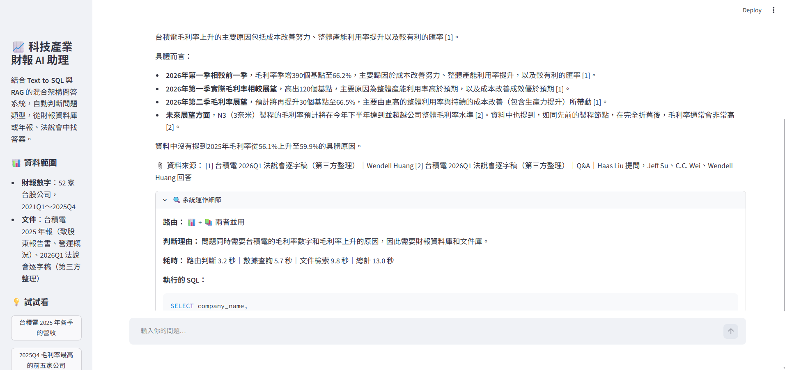
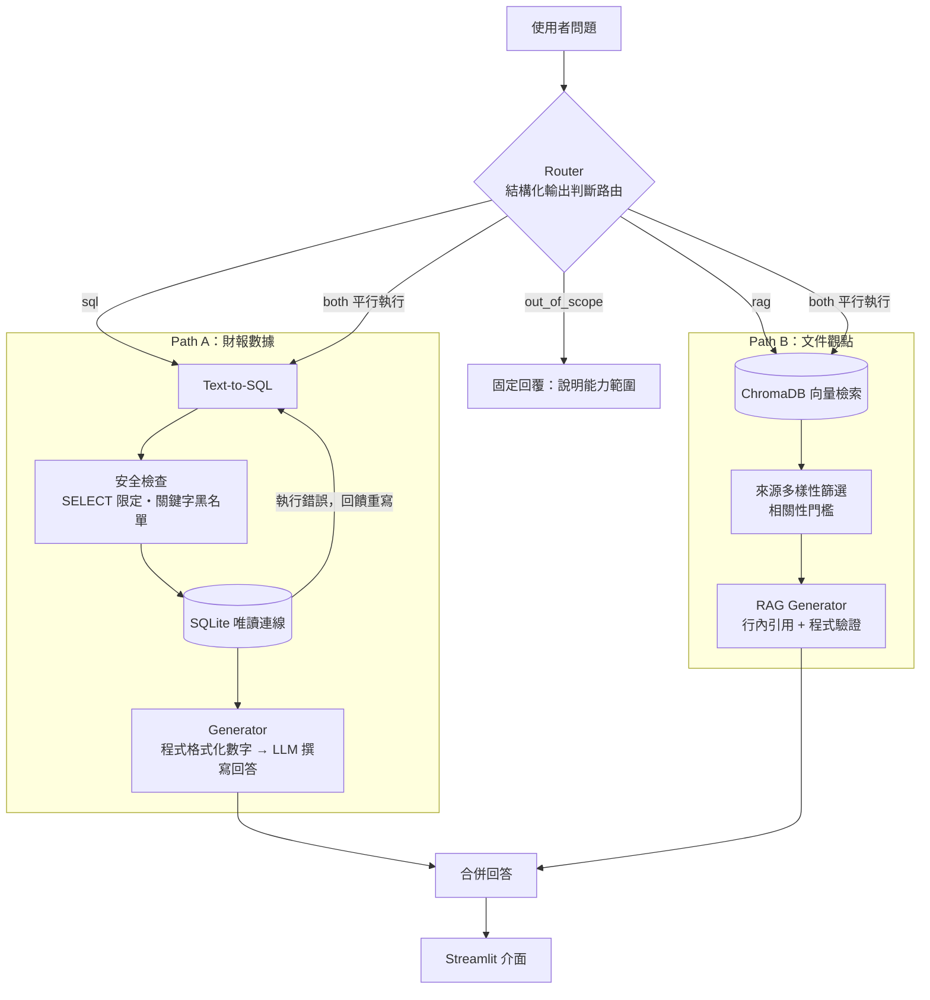

# 📈 科技產業情報與財報｜混合架構 RAG 智慧問答 Agent

結合 **Text-to-SQL** 與 **RAG（檢索增強生成）** 的問答系統。使用者用自然語言提問，系統自動判斷問題類型：數字題查詢財報資料庫，觀點題檢索台積電年報與法說會，需要「數字 + 原因」的問題則兩條路同時執行，最後產生**附有引用來源**的中文回答。



---

## ✨ 功能特色

- **自動路由**：LLM 以結構化輸出判斷問題該走資料庫、文件庫、兩者並用，或超出範圍
- **Text-to-SQL**：自然語言轉 SQL，含四層安全防護與自我修正機制
- **RAG 檢索**：解析多欄排版 PDF 與中英對照逐字稿，回答時逐句標註引用來源
- **平行執行**：需要兩條路徑的問題同時查詢，總耗時取決於較慢的一條
- **透明可追溯**：介面可展開查看路由判斷、各階段耗時、實際執行的 SQL

### 可以問的問題

| 類型 | 範例 | 路由 |
|---|---|---|
| 財報數字 | 台積電 2025 年各季的營收？ | 📊 資料庫 |
| 排名比較 | 2025Q4 毛利率最高的前五家公司 | 📊 資料庫 |
| 經營觀點 | 台積電怎麼看 AI 需求？ | 📚 文件庫 |
| 數字 + 原因 | 台積電毛利率為什麼一直上升？ | 📊 + 📚 兩者並用 |

---

## 🏗️ 系統架構



### 資料管線

```
上游 ETL 專案（MOPS 爬蟲）──唯讀快照──→ finance_raw.db ──清洗──→ finance.db ──→ Text-to-SQL
年報 PDF・法說會逐字稿 ──解析──→ 切塊 ──Gemini Embedding──→ ChromaDB ──→ RAG
```

財報資料由另一個 ETL 專案負責抓取與入庫，本專案以 SQLite backup API 取得**唯讀快照**，避免與上游的寫入衝突，兩個專案可以獨立開發。

---

## 🛠️ 技術棧

| 類別 | 技術 |
|---|---|
| 語言 | Python 3.13 |
| LLM | Google Gemini（`gemini-2.5-flash`）|
| Embedding | `gemini-embedding-001`（768 維，區分 `RETRIEVAL_DOCUMENT` / `RETRIEVAL_QUERY`）|
| 資料庫 | SQLite（結構化財報）、ChromaDB（向量資料庫，cosine 相似度）|
| 文件解析 | PyMuPDF |
| 資料處理 | pandas、Pydantic |
| 前端 | Streamlit |

未使用 LangChain 等框架，所有流程直接串接 API 實作，以掌握每個環節的運作細節。

---

## 🔍 開發過程中解決的關鍵問題

這個專案大部分的工作不在「串接 API」，而在**發現並修正資料與模型的錯誤**。以下是幾個代表性的問題。

### 1. 財報資料稽核：MOPS 的 Q4 是全年累計值

接上 Agent 之前，先對上游資料做稽核，發現：

| 問題 | 影響 | 處理方式 |
|---|---|---|
| 損益表 Q4 為**全年累計** | 台積電 Q4 營收被誇大約 4 倍 | Q4 = 全年 − Q1 − Q2 − Q3 |
| 現金流量表**每季皆為年初累計** | 各季數字都不是單季 | 單季 = 本季累計 − 上季累計 |
| 部分科目對應錯誤（稅前淨利、稅後淨利、投資現金流）| 回答會出現錯誤數字 | 以**白名單 + View** 隔離，只開放驗證過的 14 個科目 |
| LLM 產生的公司名稱有幻覺（兩家公司都叫「長榮海運」）| 公司對應錯誤 | 人工修正 |

依「流量 vs. 存量」區分處理方式：資產負債表為時點數字不需還原，損益表與現金流量表需依各自的累計方式還原。還原後以台積電官方公布數字驗證：

| 項目 | 系統計算 | 官方公布 |
|---|---|---|
| 2025Q4 營收 | 新台幣 1,046,090 百萬元 | 新台幣 1,046,090 百萬元 |
| 2025Q4 EPS | 19.51 元 | 19.50 元（四捨五入差異）|
| 2025 各季毛利率 | 58.8% / 58.6% / 59.5% / 62.3% | 一致 |

### 2. Text-to-SQL：四層安全防護

LLM 產生的 SQL 屬於不受信任的程式碼，採用**縱深防禦**：

1. **Prompt**：規定只能使用 SELECT
2. **程式檢查**：只允許 `SELECT` / `WITH` 開頭、單一指令、禁止 `DROP`、`DELETE` 等關鍵字
3. **資料庫權限**：以唯讀模式（`mode=ro`）連線，即使前兩層被繞過，資料庫本身也會拒絕寫入
4. **結果上限**：最多回傳 200 筆

另有**自我修正迴圈**：SQL 執行錯誤時，把錯誤訊息回饋給 LLM 重寫（最多 2 次）；但**安全檢查未通過的請求絕不重試**，避免給注入攻擊更多嘗試機會。

### 3. 多欄排版 PDF：文字順序錯亂

年報為左右分欄排版，一般擷取方式會逐行橫向讀取，導致左右欄的句子交錯。解法：

- 依文字區塊的 X 座標**自動偵測欄數**（致股東報告書每頁 2 欄、營運概況每頁 4 欄）
- 先依欄位、再由上往下排序
- 以**行距分布**判斷段落邊界：量測後發現段落內行距為 4～5pt、段落間為 11pt 以上，取 8pt 為門檻

### 4. 法說會切塊：提問與回答被拆開

最初以「發言者」為單位切塊，結果分析師的提問與管理層的回答被分到不同的塊，檢索時只找到問題、找不到答案。

- 第一版改用「管理層回答後分析師再發言就分組」，但實測發現**分析師的道謝會誤觸發分組**，且**主持人有時也會直接回答問題**
- 最終改為**以分析師為單位分組**，被拆開的塊會在開頭補上該分析師「最近一次」的提問，讓每一塊都能獨立被理解

### 5. 檢索優化：來源多樣性與相關性門檻

- **多樣性**：初版前 3 名全部來自同一份逐字稿，年報的長期觀點被擠掉。改為先取 15 個候選、每份文件最多 2 段，再取前 5 段
- **門檻**：向量檢索一定會回傳結果，即使問題無關。以實驗決定門檻：

| 類別 | 相似度範圍 |
|---|---|
| 相關問題（AI 需求、2 奈米、亞利桑那擴廠、CoWoS）| 0.696 ～ 0.798 |
| 無關問題（天氣、電影）| 0.539 ～ 0.609 |

  取 **0.65** 為門檻。實驗中「員工餐廳好吃嗎」得到 0.691，查證後發現年報確實提到「各廠區提供員工餐廳」，屬於**部分可回答**的問題，系統會回答「有員工餐廳，但資料未提及餐點品質」。

### 6. 引用驗證：錯誤的源頭是第三方翻譯

逐句抽查回答時，發現 AI 加速器 CAGR 被寫成「朝向 50% 的高端」，原文為 *"toward higher 50s"*（50 幾 % 的高段）。追查後確認**錯誤來自第三方逐字稿的中文翻譯本身**，而非 LLM。因此規定數字以英文原文為準，並在回答中附上原文。

其他引用相關的保護機制：
- 程式驗證引用編號，刪除不存在的編號（例如只有 4 段卻引用 [6]）
- 引用清單由程式產生，只列出實際被引用的來源
- 「資料中沒有提到」的句子，由程式移除其引用編號

### 7. Router 評估：避免資料洩漏

以 17 題測試集評估路由準確率（**17/17**）。初版 12 題中有數題與 Prompt 範例幾乎相同，屬於**資料洩漏**，因此另外加入 5 題未出現在 Prompt 中的困難題（口語化說法、非台積電公司的觀點題、美股公司等）。

評估時也發現：**路由正確不代表輸出正確**。「聯電營收是不是比去年差」路由正確，但子問題被換算成錯誤的年份。修正方式是讓 Router 保留原始的時間說法，由知道資料範圍的 Text-to-SQL 負責換算。

---

## 📊 系統表現

| 路由 | 平均耗時 | 主要瓶頸 |
|---|---|---|
| out_of_scope | 約 1.3 秒 | 僅路由判斷 |
| sql | 約 6 秒 | Text-to-SQL + 回答生成 |
| rag | 約 12 秒 | 附引用的長回答生成 |
| both | 約 8～17 秒 | 兩條路徑平行執行 |

---

## 📁 專案結構

```
tech_rag_agent/
├── app.py                    # Streamlit 介面
├── check_env.py              # 環境健康檢查
├── requirements.txt
├── .env.example              # 環境變數範本
├── data/                     # 資料（不納入版本控制）
│   ├── finance_raw.db        #   上游資料庫快照
│   ├── finance.db            #   清洗後的資料庫
│   ├── docs/                 #   年報、逐字稿
│   └── chroma/               #   向量資料庫
└── src/
    ├── sync_data.py          # 資料同步：快照 → 清洗 → 建立 MVP 資料層
    ├── data_audit.py         # 資料稽核
    ├── clean_financials.py   # 還原單季數字（流量／存量）
    ├── build_mvp_tables.py   # 白名單科目與公司表、v_financials 視圖
    ├── text_to_sql.py        # 動態資料說明書 + SQL 生成
    ├── sql_executor.py       # 安全檢查與唯讀執行
    ├── sql_agent.py          # 自我修正迴圈
    ├── generator.py          # Path A 回答生成
    ├── doc_loader.py         # 文件讀取（多欄 PDF、逐字稿）
    ├── chunker.py            # 切塊（Q&A 分組、中英對照綁定）
    ├── vector_store.py       # Embedding 與 ChromaDB
    ├── retriever.py          # 檢索（多樣性、門檻）
    ├── rag_generator.py      # Path B 回答生成與引用驗證
    ├── router.py             # 路由判斷與問題拆解（含測試集）
    └── agent.py              # 總指揮：串接所有模組
```

---

## 🚀 安裝與執行

### 1. 建立環境

```bash
git clone https://github.com/eric87911/tech-rag-agent.git
cd tech-rag-agent
python -m venv .venv
.venv\Scripts\Activate.ps1        # Windows PowerShell
pip install -r requirements.txt
```

### 2. 設定環境變數

複製 `.env.example` 為 `.env`，填入：

```
GEMINI_API_KEY=你的 Gemini API Key
GEMINI_MODEL=gemini-2.5-flash
EMBED_MODEL=gemini-embedding-001
SOURCE_DB=上游財報資料庫的路徑
```

### 3. 準備資料

本專案的資料**不包含在儲存庫中**：

- **財報資料庫**：由另一個 MOPS 爬蟲 ETL 專案產生，路徑設定於 `SOURCE_DB`
- **文件**：放入 `data/docs/`，檔名格式為 `公司_期間_類型_說明.副檔名`
  - `TSMC_2025_annual_ch1_letter.pdf`（台積電年報 致股東報告書）
  - `TSMC_2025_annual_ch5_operations.pdf`（台積電年報 營運概況）
  - `TSMC_2026Q1_transcript.txt`（法說會逐字稿）

### 4. 建立資料層與向量資料庫

```bash
python src/sync_data.py       # 同步並清洗財報資料
python src/vector_store.py    # 建立向量資料庫
```

### 5. 啟動

```bash
streamlit run app.py
```

---

## ⚠️ 已知限制

- **財報資料截至 2025Q4**：上游使用的舊版 MOPS 網站無法解析 2026 年的新版 XBRL Taxonomy，2026 年資料暫不開放
- **兩條路徑的時間範圍不一致**：財報數字截至 2025Q4，法說會逐字稿為 2026Q1，`both` 類問題的兩段回答可能談的是不同期間
- **文件僅涵蓋台積電**：其他公司的觀點類問題會被判斷為超出範圍
- **逐字稿為第三方整理**：中文翻譯可能有誤，數字以英文原文為準；檔案受版權限制，不包含在儲存庫中
- **沒有對話記憶**：每個問題獨立處理，無法理解「那聯電呢？」這類追問
- **評估樣本有限**：檢索門檻以 7 題、路由以 17 題評估，尚需更大的評估集

## 🗺️ 未來規劃

- [ ] 上游資料來源改用 FinMind API，取代舊版 MOPS 爬蟲
- [ ] 補齊稅後淨利、現金流量等科目的對應，擴充白名單
- [ ] 支援多輪對話（由 Router 改寫追問為完整問題）
- [ ] 民國年由程式統一轉換為西元年
- [ ] Router 的資料範圍描述改為從資料庫動態產生
- [ ] 建立更大的評估集（30～50 題）
- [ ] 改用 Function Calling 實作 Agent 工具呼叫

---

## 📚 資料來源

- 財務報表：公開資訊觀測站（MOPS）
- 台積電 2025 年報：台積電投資人關係網站
- 法說會逐字稿：第三方網站整理（僅供個人學習使用，不公開散布）

## 👤 作者

Chuang Hao-yu｜[@eric87911](https://github.com/eric87911)
